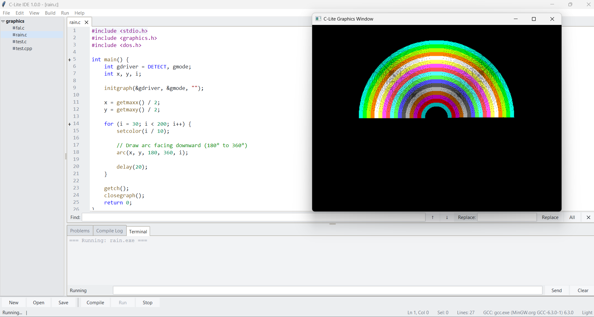
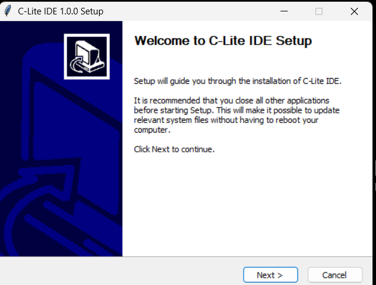

<div align="center">

# C-Lite IDE

**A lightweight, offline C/C++ IDE for Windows with Turbo C / Borland-style compatibility**

[](#releases)
[](#compatibility)
[-orange)](#compiler-and-runtime)
[](#license)

**[Website](https://clite.vercel.app/) · [Download Latest Release](#releases) · [Report an Issue](../../issues)**

</div>

---

C-Lite is a simple, student-friendly development environment for C and C++ on Windows. It ships with a bundled MinGW toolchain, a tabbed code editor, integrated build/run tools, an in-app terminal, and compatibility layers for `graphics.h` and `conio.h` — so classic Turbo C / Borland-style programs run without modification.

## Screenshots

<table>
<tr>
<td width="55%">

**Editor with live graphics output**
Turbo C-style `graphics.h` programs run natively through C-Lite's built-in GDI graphics runtime, with the editor, compile log, and terminal all in one window.

</td>
<td width="45%">

</td>
</tr>
<tr>
<td width="55%">

**Simple Windows installer**
A guided NSIS-based setup installs the IDE, bundled MinGW compiler, compatibility headers, graphics/console runtime, and example programs — no separate Python or compiler install required.

</td>
<td width="45%">

</td>
</tr>
</table>

## Table of Contents

- [Highlights](#highlights)
- [Compatibility](#compatibility)
- [Getting Started](#getting-started)
- [Building](#building)
- [Project Structure](#project-structure)
- [Compiler and Runtime](#compiler-and-runtime)
- [Testing](#testing)
- [Releases](#releases)
- [License](#license)
- [Author](#author)
- [Acknowledgments](#acknowledgments)

## Highlights

- Tabbed C/C++ editor with syntax highlighting, line numbers, code folding, find/replace, and Go to Line
- Project and file explorer with common file operations
- One-click compile and run
- Integrated terminal with standard input support
- Compile log and Problems panel with navigable diagnostics
- Automatic C/C++ compiler selection for `.c`, `.cpp`, `.cc`, and `.cxx`
- Turbo C-compatible `graphics.h` and `conio.h` APIs
- Native Windows GDI graphics runtime with double-buffered rendering
- Dark and light editor themes
- Windows DPI-aware rendering
- Bundled 32-bit MinGW GCC 6.3.0 toolchain
- Fully offline runtime after installation
- Self-contained Windows distribution
- Built-in update checker through GitHub Releases

## Compatibility

### Supported OS

- Windows 10
- Windows 11

### Running from source

- Python 3.10 or newer
- `tkinter` (included with standard Python Windows installations)
- No additional runtime packages are required

### Packaged application

The packaged application does not require Python or a separate compiler installation.

## Getting Started

### Download (recommended)

Grab the latest installer from the [C-Lite IDE website](https://clite.vercel.app/) or the project's [GitHub Releases](../../releases) page, then run `C-Lite-IDE-Setup-<version>.exe` and follow the setup wizard.

### Run from source

```cmd
git clone <your-repository-url>
cd C-Lite-IDE
python clite.py
```

You can also use the Windows launcher:

```cmd
start.bat
```

### Using the installer

The installer provides:

- C-Lite IDE
- Bundled MinGW compiler
- C-Lite compatibility headers
- Graphics and console runtime
- Example programs
- Application resources
- Windows Start Menu and optional desktop shortcuts
- Uninstaller

Personal source-code projects are not removed when C-Lite IDE is uninstalled.

## Building

### Build the application

Install the build dependency:

```cmd
pip install pyinstaller
```

Then run:

```cmd
cd packaging
build_ide.bat
```

The build produces a self-contained application directory containing the IDE and required compiler/runtime files.

### Build the Windows installer

The release pipeline uses **NSIS** to create the installer.

Run:

```cmd
cd packaging
build_release.bat
```

The installer is generated in:

```text
release\C-Lite-IDE-Setup-<version>.exe
```

Before building a release, make sure NSIS and PyInstaller are installed and available to the build scripts.

## Project Structure

```text
C-Lite-IDE/
├── clite_ide/
│   ├── app.py           # Main application and UI
│   ├── builder.py       # Compilation and toolchain integration
│   ├── runner.py        # Program execution
│   ├── tabs.py          # Editor tab management
│   ├── editor.py        # Code editor
│   ├── explorer.py      # Project/file explorer
│   ├── terminal.py      # Integrated terminal
│   ├── compilelog.py    # Compiler output
│   ├── problems.py      # Error and warning navigation
│   ├── project.py       # Project model
│   ├── settings.py      # Preferences and compiler configuration
│   ├── dialogs.py       # Application dialogs
│   ├── uistyle.py       # Shared UI styling
│   ├── dpi.py           # Windows DPI handling
│   ├── windows.py       # Windows application integration
│   ├── lexer.py         # C/C++ syntax highlighting
│   └── examples.py      # Example program catalog
├── compiler/
│   └── mingw/           # Bundled MinGW GCC 6.3.0 toolchain
├── include/              # C-Lite compatibility headers
├── runtime/
│   ├── bgilite.c         # graphics.h / BGI compatibility runtime
│   ├── conio_lite.c      # conio.h compatibility runtime
│   └── clite_startup.c   # Runtime startup support
├── examples/
│   ├── console/          # Console examples
│   └── graphics/         # Graphics examples
├── icons/                # Application icons
├── packaging/            # Build and installer scripts
├── tests/                # Automated and smoke tests
├── clite.py              # Application entry point
├── version.txt           # Release version
├── settings.json         # User settings (created at runtime)
├── C-Lite IDE.spec        # PyInstaller specification
├── start.bat             # Windows launcher
└── README.md             # Project documentation
```

## Compiler and Runtime

C-Lite bundles **MinGW.org GCC 6.3.0 (32-bit)** to provide a consistent offline toolchain.

The compiler discovery order is:

1. Bundled MinGW compiler
2. User-configured GCC path
3. `gcc` available on the system `PATH`
4. Common MinGW/TDM-GCC/MSYS2 installation locations

### Graphics compatibility

The graphics runtime provides a Windows GDI implementation of the classic BGI API, supporting common Turbo C graphics functionality including:

- Lines, circles, rectangles, ellipses, arcs, sectors, and pies
- Polygons and filled polygons
- Bar and bar3d operations
- Flood fill
- Text rendering
- Viewports
- Palette operations
- Image operations

The historical BGI driver path used by programs such as:

```c
initgraph(&gd, &gm, "C:\\TURBOC3\\BGI");
```

is accepted for compatibility but is not required — C-Lite supplies its own runtime.

### Conio compatibility

C-Lite implements commonly used Turbo C console functions including:

- `getch()`
- `kbhit()`
- `clrscr()`
- `gotoxy()`
- `textColor()`
- `textBackground()`
- `cprintf()`
- `delay()`
- `sound()`
- `nosound()`

## Testing

Run the test suite from the project root:

```cmd
python tests\test_tabs.py
python tests\test_close_state.py
python tests\test_dialog_center.py
python tests\test_statusbar.py
python tests\test_explorer.py
python tests\smoke.py
python tests\e2e.py
python tests\input_test.py
```

For release builds, verify at minimum:

- Application startup
- File open/save/close behavior
- Compile and run
- C and C++ compilation
- Integrated terminal input/output
- Graphics programs
- Project/file operations
- Settings persistence
- Installer installation
- Start Menu/Desktop shortcuts
- Uninstallation
- Clean installation on a Windows machine without Python

## Releases

C-Lite follows [Semantic Versioning](https://semver.org/):

```text
MAJOR.MINOR.PATCH
```

| Version | Notes |
|---|---|
| **1.0.0** | Initial release — current version, tracked in `version.txt` |

> Additional installer builds placed in `release/` (e.g. `C-Lite-IDE-Setup-<version>.exe`) should be added to this table as they're published. Download the latest build from the [website](https://clite.vercel.app/) or the [GitHub Releases](../../releases) page.

Versioning conventions:

- `1.0.0` — Initial release
- `1.0.1` — Bug fixes
- `1.1.0` — Backward-compatible features
- `2.0.0` — Breaking changes

### Release checklist

1. Update `version.txt`.
2. Run the full test suite.
3. Build the application.
4. Build the NSIS installer.
5. Test the installer on a clean Windows environment.
6. Verify compile, run, terminal, and graphics functionality.
7. Commit the release changes.
8. Create and push the corresponding Git tag.
9. Publish the installer with the GitHub Release.

## License

This project is distributed under the license included in the repository's [`LICENSE`](LICENSE) file.

## Author

**Nitin Raj**

- [LinkedIn](https://www.linkedin.com/in/nitin-raj-17d12/)
- [Portfolio](https://nitin-raj-vercel.app)
- [C-Lite IDE Website](https://clite.vercel.app/)

## Acknowledgments

- [Python / Tkinter](https://www.python.org/)
- [MinGW](https://www.mingw-w64.org/)
- Windows GDI
- NSIS
